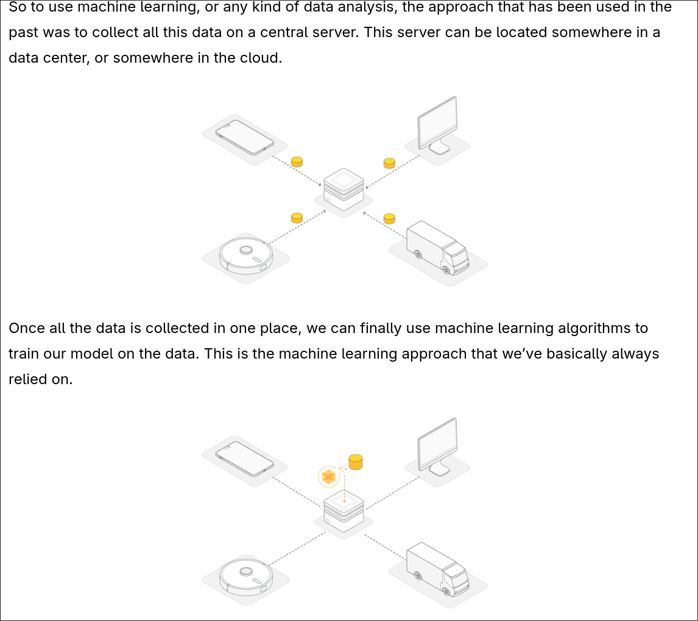
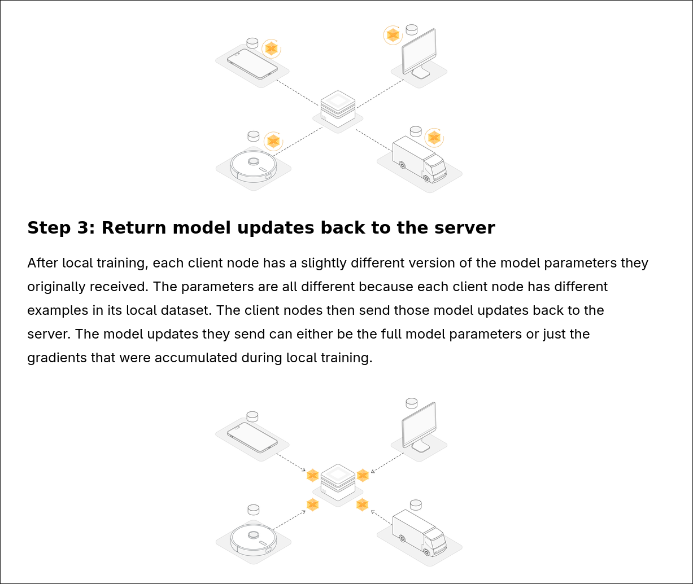

# 联邦学习基础概念

参考自 [`flower: What is Federated Learning`](https://flower.ai/docs/framework/tutorial-series-what-is-federated-learning.html)

## 1.1 联邦学习的定义与背景

- **传统机器学习**: 数据上传，训练全局模型 
将大量的原始数据和信息上传到中心服务器
依靠这些数据训练出强大的中心模型
中心模型直接发放给各个客户端使用

- **数据隐私**日益重要的时代背景 
各种保护隐私的法律不断完善
AI训练对于数据有非常大的需求
而绝大多数的真实数据都是受保护的，隐私的，不能直接获取的

- 在这样的条件下,传统的机器学习遇到了**数据源被限制，缺乏优良的真实数据**的问题,于是催生了联邦学习 (Federated Learning)

- **联邦学习**：数据留在本地，模型参数/梯度通信

> [!TIP]
> 两者的直接对比 
> Centralized machine learning: move the data to the computation 
> Federated (machine) Learning: move the computation to the data 

也就是说 **联邦学习不传输原始数据, 而是传输由原始数据计算得来的经验**
在机器学习中，经验的载体是 **模型的权重或者梯度**

## 1.2 联邦学习的基本工作流程

1. 服务器初始化全局模型
2. 分发模型至各客户端
3. 客户端使用本地数据训练
4. 上传模型更新（梯度/权重）
5. 服务器聚合更新，生成新全局模型(并广播)
6. 迭代直至收敛

## 1.3 联邦学习的典型架构

- Client-Server 架构
- 通信轮次 (Communication Round)
- 参与率 (Participation Rate)

---

- [Next: 现有问题与痛点](./problems.md)
