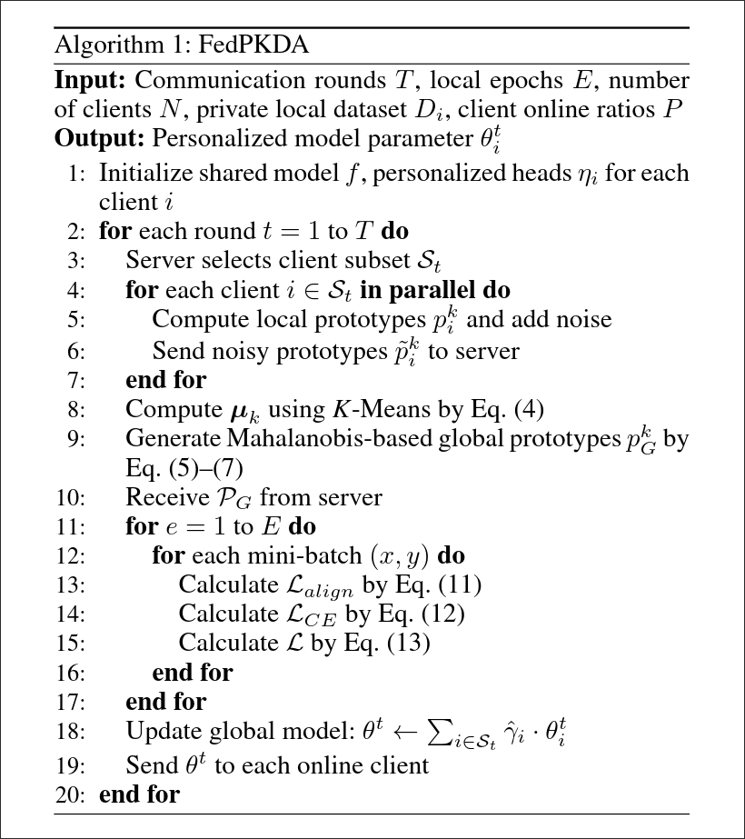

# FedPKDA 方法全流程

**目标：** 完整呈现论文的核心方案

## 3.1 总体框架概览

- 三大核心模块关系图
- 数据流向：客户端 → 服务器 → 客户端

## 3.2 模块一: 跨客户端原型隐私保护

- 特征提取与裁剪 (Clipping)
- 本地类原型计算 (均值特征)
- [拉普拉斯噪声](https://en.wikipedia.org/wiki/Laplace_distribution) 注入机制
- 上传**带噪原型**至服务器

## 3.3 模块二: 服务器端几何滤波

- K-Means **聚类**获取几何中心
- [马氏距离](/docs/utils/ma_distance.md) 计算各原型**偏离程度**
- 反距离**加权聚合**
- 生成干净全局原型

## 3.4 模块三: 客户端知识动态对齐

- 本地对齐损失: 对齐本地原型
- 全局对齐损失: 对齐全局原型
- 时间激活函数 φ(t) 控制权重分配
- 早期偏向本地，后期偏向全局

## 3.5 模型聚合

- Fisher Information Matrix 计算
- 重要性加权聚合

## 伪代码

---

- [Previous: 现有问题和痛点](./problems.md)

- [Next: 总结](./summary.md)
