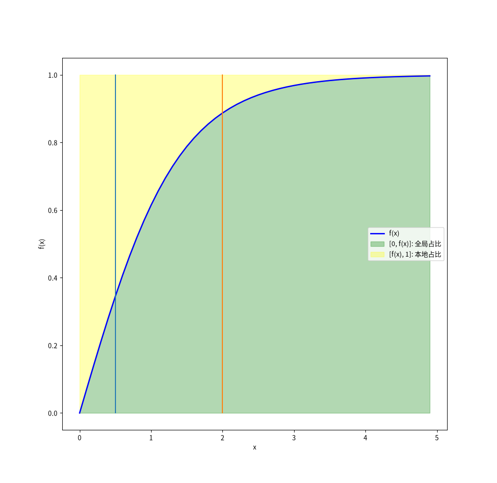

# 时间激活函数

[back: fedpkda](../fedpkda.md)

- 公式
  $φ(t) = \frac{log(1 + e^t) - log(1 + e^{-t})}{log(1 + e^t) + log(1 + e^{-t})}$

- 函数图像
  

- 绘制代码

```python
import numpy as np
import matplotlib.pyplot as plt


def function(x):
    x = np.asarray(x, dtype=np.float64)
    a = 1 + np.exp(x)
    b = 1 + np.exp(-x)
    numerator = np.log(a) - np.log(b)
    denominator = np.log(a) + np.log(b)
    return numerator / denominator


X = np.arange(0, 5, 0.1, dtype=np.float32)
Y = function(X)

plt.rcParams["font.sans-serif"] = ["Noto Sans CJK SC"]  # 或其他已安装的中文字体

plt.plot(X, Y, "b-", linewidth=2, label="f(x)")

plt.plot([0.5, 0.5], [0, 1])
plt.plot([2, 2], [0, 1])

# 填充 [0, Y] 区域为绿色
plt.fill_between(X, 0, Y, color="green", alpha=0.3, label="[0, f(x)]: 全局占比")

# 填充 [Y, 1] 区域为黄色
plt.fill_between(X, Y, 1, color="yellow", alpha=0.3, label="[f(x), 1]: 本地占比")

plt.xlabel("x")
plt.ylabel("f(x)")
plt.legend()
plt.show()
```
