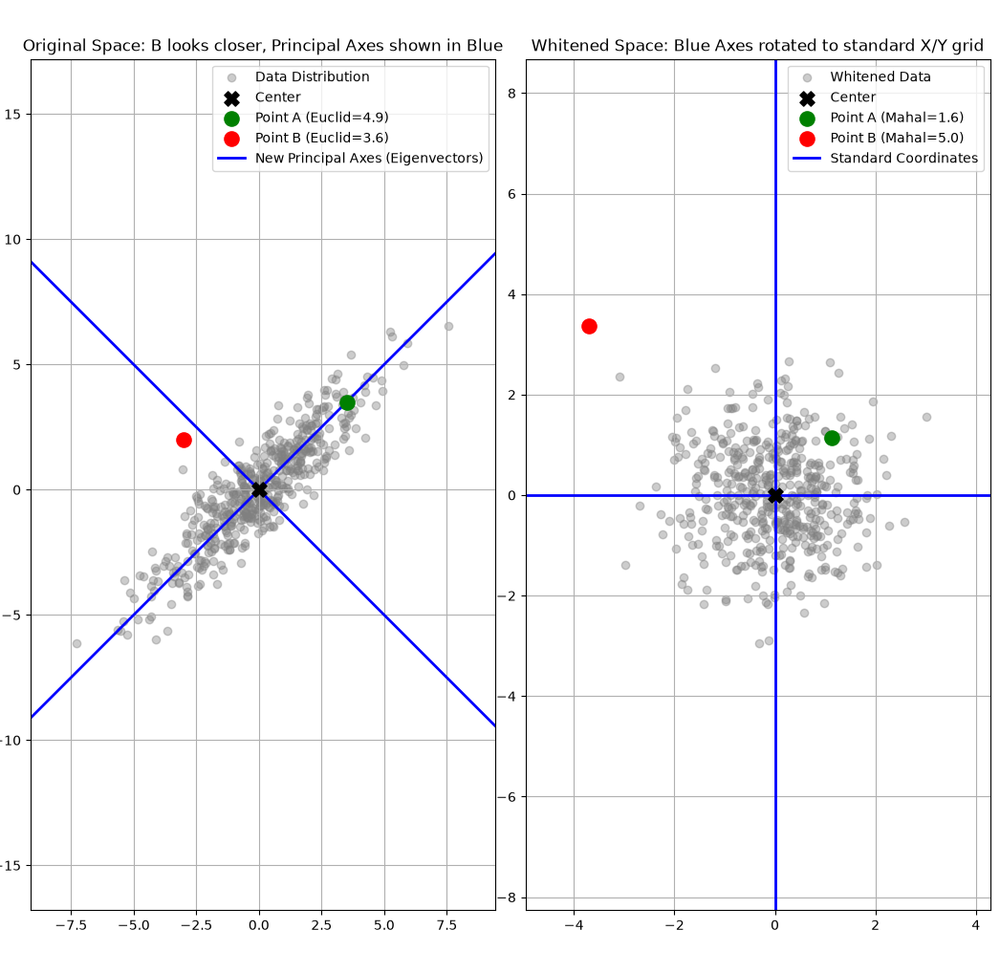

# Mahalanobis Distance

[back: fedpkda](../fedpkda.md)

[wiki](https://en.wikipedia.org/wiki/Mahalanobis_distance)

马氏距离（Mahalanobis Distance）是由印度统计学家马哈拉诺比斯提出的，用来计算点与数据分布之间的协方差距离。它的核心优点包括考虑特征相关性、消除量纲影响以及对数据旋转缩放免疫。

本质: 先对基于样本的分布情况**进行线性变换**，再计算欧氏距离， 保证计算出来的距离更能够反映样本对于总体分布的偏离情况



---

- 下面是展示使用的代码， 可以自行修改或者使用

```python
import numpy as np
import matplotlib.pyplot as plt

# 1. Generate highly correlated 2D data (Stretched along the x = y line)
np.random.seed(42)
mean = np.array([0, 0])
cov = np.array([[5, 4.5], [4.5, 5]])  # Strong positive correlation
X = np.random.multivariate_normal(mean, cov, 500)

# 2. Define center point and two specific test points
p_center = np.array([0, 0])
p_A = np.array(
    [3.5, 3.5]
)  # Point A: Far in space, but aligns with the data distribution
p_B = np.array(
    [-3.0, 2.0]
)  # Point B: Close to center, but completely violates the correlation

# 3. Eigenvalue decomposition for whitening transformation
eigenvalues, eigenvectors = np.linalg.eigh(cov)
whitening_matrix = eigenvectors @ np.diag(1.0 / np.sqrt(eigenvalues)) @ eigenvectors.T

# 4. Transform data and points to the whitened space
X_transformed = X @ whitening_matrix.T
p_center_trans = p_center @ whitening_matrix.T
p_A_trans = p_A @ whitening_matrix.T
p_B_trans = p_B @ whitening_matrix.T

# 5. Distance Calculations
euclid_A = np.linalg.norm(p_A - p_center)
euclid_B = np.linalg.norm(p_B - p_center)

inv_cov = np.linalg.inv(cov)
mahal_A = np.sqrt((p_A - p_center).T @ inv_cov @ (p_A - p_center))
mahal_B = np.sqrt((p_B - p_center).T @ inv_cov @ (p_B - p_center))

# 6. Plotting
fig, ax = plt.subplots(1, 2, figsize=(15, 6))
ax_flat = np.asarray(ax).flatten()

# --- Left plot: Original space (Elongated Ellipse with Principal Axes lines) ---
ax_flat[0].scatter(X[:, 0], X[:, 1], alpha=0.4, color="gray", label="Data Distribution")
ax_flat[0].scatter(
    p_center[0], p_center[1], color="black", s=120, zorder=5, marker="X", label="Center"
)
ax_flat[0].scatter(
    p_A[0],
    p_A[1],
    color="green",
    s=120,
    zorder=5,
    label=f"Point A (Euclid={euclid_A:.1f})",
)
ax_flat[0].scatter(
    p_B[0],
    p_B[1],
    color="red",
    s=120,
    zorder=5,
    label=f"Point B (Euclid={euclid_B:.1f})",
)

for i in range(len(eigenvalues)):
    direction = eigenvectors[:, i]
    # slope = delta_y / delta_x
    slope_val = direction[1] / direction[0]
    ax_flat[0].axline(
        xy1=(p_center[0], p_center[1]),
        slope=slope_val,
        color="blue",
        linewidth=2,
        label="New Principal Axes (Eigenvectors)" if i == 0 else "",
    )

ax_flat[0].set_title("Original Space: B looks closer, Principal Axes shown in Blue")
ax_flat[0].axis("equal")
ax_flat[0].legend()
ax_flat[0].grid(True)

# --- Right plot: Transformed space (Perfect Circle with Standard Axes) ---
ax_flat[1].scatter(
    X_transformed[:, 0],
    X_transformed[:, 1],
    alpha=0.4,
    color="gray",
    label="Whitened Data",
)
ax_flat[1].scatter(
    p_center_trans[0],
    p_center_trans[1],
    color="black",
    s=120,
    zorder=5,
    marker="X",
    label="Center",
)
ax_flat[1].scatter(
    p_A_trans[0],
    p_A_trans[1],
    color="green",
    s=120,
    zorder=5,
    label=f"Point A (Mahal={mahal_A:.1f})",
)
ax_flat[1].scatter(
    p_B_trans[0],
    p_B_trans[1],
    color="red",
    s=120,
    zorder=5,
    label=f"Point B (Mahal={mahal_B:.1f})",
)

# Plot the standard horizontal and vertical axes in the new space for comparison
ax_flat[1].axhline(y=0, color="blue", linewidth=2, label="Standard Coordinates")
ax_flat[1].axvline(x=0, color="blue", linewidth=2)

ax_flat[1].set_title("Whitened Space: Blue Axes rotated to standard X/Y grid")
ax_flat[1].axis("equal")
ax_flat[1].legend()
ax_flat[1].grid(
    True,
)

plt.tight_layout()
plt.show()
```
